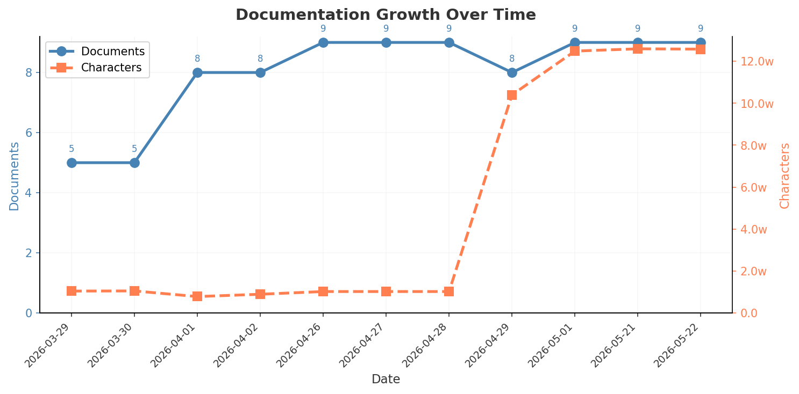

# 技术研究档案库

> 本索引由脚本自动生成，请勿手动编辑
>
> 最后更新：2026-04-29 02:36
>
> 数据源：[index.json](./.readme/index.json)

---

## 统计概览

---

## 研究方向

### Agent

| 研究主题 | 报告数量 | 最新报告 |
|----------|----------|----------|
| [实践经验总结](./Agent/实践经验总结/) | 2 | 1.0 |
| [源码分析](./Agent/源码分析/) | 1 | 1.0 |

### JDK

| 研究主题 | 报告数量 | 最新报告 |
|----------|----------|----------|
| [演进史](./JDK/演进史/) | 1 | v1.0 |

### OpenClaw

| 研究主题 | 报告数量 | 最新报告 |
|----------|----------|----------|
| [架构分析](./OpenClaw/架构分析/) | 1 | 1.0 |

### 前端状态管理

| 研究主题 | 报告数量 | 最新报告 |
|----------|----------|----------|
| [演进史](./前端状态管理/演进史/) | 1 | v1.2 |

### 对话结构

| 研究主题 | 报告数量 | 最新报告 |
|----------|----------|----------|
| [研究报告](./对话结构/研究报告/) | 1 | 5.0 |

### 文生视频模型

| 研究主题 | 报告数量 | 最新报告 |
|----------|----------|----------|
| [对比评测](./文生视频模型/对比评测/) | 1 | 1.0 |

---

## 所有报告

**Agent**

- **实践经验总结**:
  - [AI 协作经验总结](./Agent/%E5%AE%9E%E8%B7%B5%E7%BB%8F%E9%AA%8C%E6%80%BB%E7%BB%93/AI%20%E5%8D%8F%E4%BD%9C%E7%BB%8F%E9%AA%8C%E6%80%BB%E7%BB%93.md) `1.0`
  - [设计实践](./Agent/%E5%AE%9E%E8%B7%B5%E7%BB%8F%E9%AA%8C%E6%80%BB%E7%BB%93/%E8%AE%BE%E8%AE%A1%E5%AE%9E%E8%B7%B5.md) `1.0`
- **源码分析**:
  - [Claude Code 架构分析](./Agent/%E6%BA%90%E7%A0%81%E5%88%86%E6%9E%90/Claude%20Code%20%E6%9E%B6%E6%9E%84%E5%88%86%E6%9E%90.md) `1.0`

**JDK**

- **演进史**:
  - [report_v1.0](./JDK/%E6%BC%94%E8%BF%9B%E5%8F%B2/report_v1.0.md) `v1.0`

**OpenClaw**

- **架构分析**:
  - [OpenClaw 核心架构深度解析](./OpenClaw/%E6%9E%B6%E6%9E%84%E5%88%86%E6%9E%90/OpenClaw%20%E6%A0%B8%E5%BF%83%E6%9E%B6%E6%9E%84%E6%B7%B1%E5%BA%A6%E8%A7%A3%E6%9E%90.md) `1.0`

**前端状态管理**

- **演进史**:
  - [report_v1.2](./%E5%89%8D%E7%AB%AF%E7%8A%B6%E6%80%81%E7%AE%A1%E7%90%86/%E6%BC%94%E8%BF%9B%E5%8F%B2/report_v1.2.md) `v1.2`

**对话结构**

- **研究报告**:
  - [对话结构研究报告](./%E5%AF%B9%E8%AF%9D%E7%BB%93%E6%9E%84/%E7%A0%94%E7%A9%B6%E6%8A%A5%E5%91%8A/%E5%AF%B9%E8%AF%9D%E7%BB%93%E6%9E%84%E7%A0%94%E7%A9%B6%E6%8A%A5%E5%91%8A.md) `5.0`

**文生视频模型**

- **对比评测**:
  - [2026 主流模型全景对比](./%E6%96%87%E7%94%9F%E8%A7%86%E9%A2%91%E6%A8%A1%E5%9E%8B/%E5%AF%B9%E6%AF%94%E8%AF%84%E6%B5%8B/2026%20%E4%B8%BB%E6%B5%81%E6%A8%A1%E5%9E%8B%E5%85%A8%E6%99%AF%E5%AF%B9%E6%AF%94.md) `1.0`

---

## 相关文档

详见 [DOCS.md](./DOCS.md)。